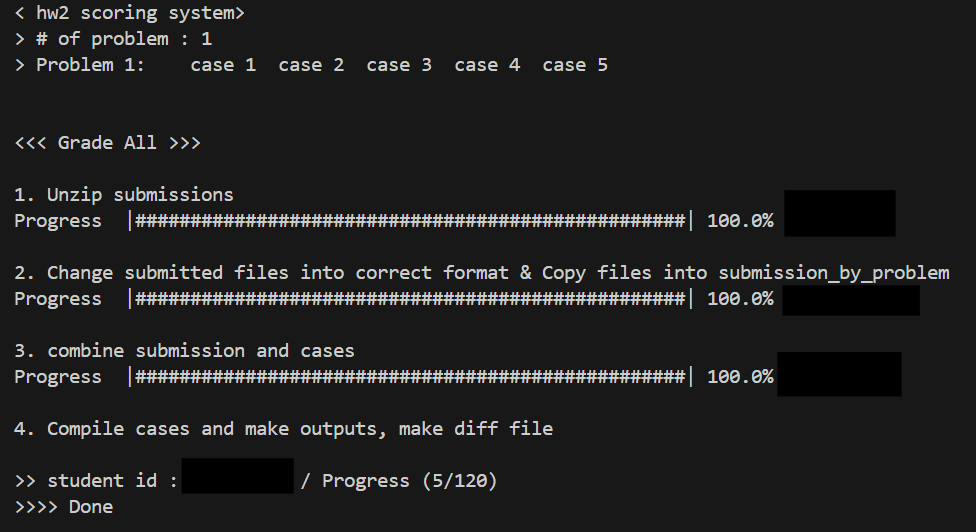
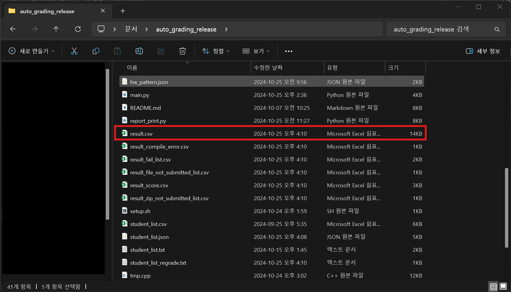
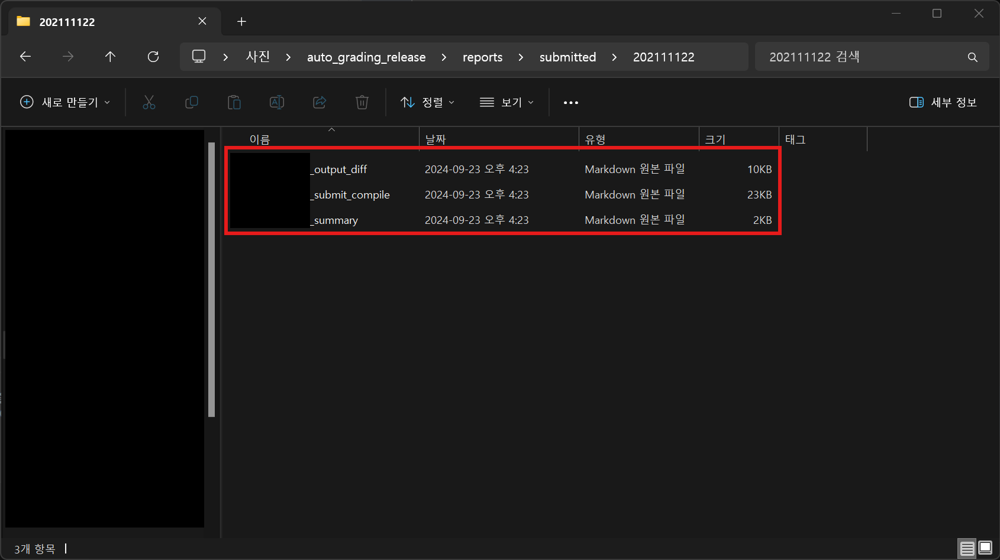

# HOW TO USE

## 이용방법

리눅스 `bash` 쉘에서 동작합니다. 리눅스 환경을 우선 준비해둬야 합니다. 

### 1. 필수 요건 설치

`git`, `zip`, `unzip`, `dos2unix`, `perl`을 설치합니다.

```bash
sudo apt install git zip unzip dos2unix perl
```

### 2. 프로그램 설치

각 assignment 버전에 맞는 최신 release zip 파일을 다운받아 압축해제 합니다. 

예를 들어, assignment 1 채점 프로그램을 얻는다고 하면, assignment 1이 붙은 release 중 가장 최신 버전을 다운받으면 됩니다.


또는, 이 repository를 clone 한 후, assignment 버전에 해당하는 branch로 checkout합니다.

예를 들어, assignment 1 채점 프로그램을 얻는다고 하면, 이 repository를 clone한 후, assignment 1에 해당하는 branch인 `2024-CSE201-Assignment-1`로 checkout하면 됩니다. 

```bash
git clone https://github.com/saychuwho/auto_grading_release.git
cd auto_grading_release/
git checkout 2024-CSE201-Assignment-1
```


### 3. 스크립트에 실행 권한 주기

다음 명령어를 실행합니다. 

```bash
chmod ug+x ./_moss.pl
```

### 4. 채점 파일 준비하기

채점하고자 하는 학생들의 `.zip` 파일을 `./student_submission` 폴더에 넣습니다.


### 5. 채점 시작

`python main.py`를 실행합니다.

```bash
python main.py
```

`main.py`는 다음과 같이 실행될 때 현재 채점하는 Assignment의 정보를 보여줍니다. Assignment 정보에는 Assignment에 있는 문제, 문제 별 test case의 수가 포함됩니다. 다음 사진은 Assignment 1의 정보를 보여줍니다. 


`main.py`는 실행되는 동안 진행 상황과 현재 어떤 모드로 실행되고 있는지를 다음과 같이 보여줍니다.



### 6. 결과 확인

`main.py`는 다음 파일들을 생성합니다.

1. 모든 학생의 테스트 케이스 통과 여부를 담고 있는 `result.csv`



엑셀로 열면 다음과 같이 학생별로 테스트 케이스의 결과 정보들을 담고 있습니다. 


2. 모든 학생의 테스트 케이스 별 점수 여부와 총 점을 담고 있는 `result_score.csv`


엑셀로 열면 다음과 같이 학생별로 테스트 케이스에서 얻은 점수와 총점을 담고 있습니다. 


3. 학생 별 평가 개요, 제출한 코드와 컴파일 결과, 출력 결과를 보여주는 마크다운 리포트

다음 폴더에 마크다운 리포트가 저장되어 있습니다.


`not_submitted`에는 zip 파일을 제출 안 한 학생들의 리포트가, `submitted` 폴더에는 zip 파일을 제출 한 학생들의 리포트가 있습니다. 


`not_submitted`, `submitted` 폴더에는 학생들의 학번별로 폴더가 생성되어 있는데, 폴더 속에 학생별 리포트 파일이 있습니다. 마크다운 파일들은 vscode를 이용해 열면 렌더링 된 상태로 볼 수 있습니다. 



`_summary.md`는 학생의 채점 결과와 학생이 제출한 zip 파일 속 내용물에 대한 정보를 볼 수 있습니다.


`_submit_compile.md`는 학생이 제출한 소스코드와 이를 바탕으로 컴파일 한 소스코드, 컴파일 결과를 볼 수 있습니다. 컴파일 결과에 아무것도 없으면 컴파일이 정상적으로 진행되었다는 의미이고, 컴파일 결과에 내용이 있다면 컴파일 에러가 일어났다는 의미입니다.


`_output_diff.md`는 테스트 케이스 별 학생 코드의 출력 결과, 정답 출력 결과와의 `diff` 결과를 보여줍니다.


출력 형식을 제대로 지킨 경우에는 제대로 채점이 되지만, 간혹 의미적으로는 맞지만 출력 형식을 지키지 않았거나, 제출 파일 이름 형식을 지키지 않아 채점이 되지 않을 수 있습니다. 이 경우에는 결과 파일을 바탕으로 직접 채점을 해야 할 수 있습니다.


4. 학생들의 complie error, fail 여부 등을 담고 있는 `result_compile_error.csv`, `result_fail_list.csv`, `result_file_not_submitted_list.csv`, `result_zip_file_not_submitted.csv`

채점 시 확인하기 편하도록 이번에 추가했습니다. 각 목록을 보고 채점시 참고하면 됩니다.

### 7. 기타 옵션들

옵션들은 다음과 같이 적용하면 됩니다. `--option`의 기본값은 `all`로, 기본 채점을 수행합니다.

#### 1) `reset` 옵션

채점 프로그램을 다시 실행하기 위해서는 `reset` 옵션을 실행 한 후 `main.py`를 실행해야 합니다. 

```bash
python main.py --option reset
```

`reset` 옵션을 실행하면 채점 프로그램이 초기 상태로 돌아가며, 나머지 옵션을 실행하기 위해서는 `main.py`를 다시 실행해야 합니다.

다음은 실행 예시입니다.


#### 2) `regrade` 옵션

`main.py`를 실행한 이후, `regrade` 옵션은 다음 상황에서 이용하면 됩니다.
- 특정 학생이 제출한 코드를 `./student_submission/학생학번`에서 수정한 뒤 다시 채점하고자 할때
- 제출을 늦게한 학생의 `zip` 파일을 포함한 뒤 다시 채점할 때

`regrade` 옵션이 채점하는 학생들 목록은 `main.py` 실행 이후 `student_list_regrade.list`로 나옵니다.

다음 학생들을 포함합니다.
- zip 파일을 제출하지 않는 학생
- 컴파일에 실패한 경우가 있는 학생
- 제시된 test case를 통과하지 못한 학생


```bash
python main.py --option regrade
```

이때, 학생의 소스코드를 수정할 때는 `./student_submission/학생학번/` 폴더 밑에 있는 코드 중 **이름 없이 학번만 있는 파일을 수정해야 합니다.**

즉, 이 학생의 경우 파란색 파일을 수정하ㅇ는 것이 아니라 빨간색 파일을 수정해야 합니다. 


#### 3) `MOSS` 옵션

학생들간의 코드 유사도를 측정한 결과를 담고 있는 `result_moss.md`를 반환합니다.

다음은 실행 방법입니다.

```bash
python main.py --option MOSS
```

유사도는 [MOSS](https://theory.stanford.edu/~aiken/moss/)를 이용해 측정한 결과입니다. 파일 안에 각 문제 별 유사도 측정 결과를 볼 수 있는 링크가 있습니다. 간단한 과제의 경우 유사도가 의미 없을 수 있지만, 복잡한 과제의 경우는 유사도가 중요하게 작용할 수 있습니다.

다음은 assignment 1의 경우를 표시한 경우입니다.


각 링크로 들어가면, 어떤 파일이 얼마나 유사한지를 퍼센트로 표시하고 있습니다. 정렬은 유사도가 높은 순서대로 입니다.


여기서 파일을 클릭하면, 두 소스코드가 어떤 부분에서 유사한지를 보여줍니다. 이 정보들을 종합해서 채점 시 판단하면 됩니다.


<br>

#### 4) `run_output` 옵션

컴파일이 완료된 학생에 한해서 학생의 test case 컴파일 결과를 실행할 수 있는 옵션입니다. 

다음은 실행 방법입니다. 

```bash
python main.py --option run_option 학생학번 문제번호 테스트케이스번호
```

다음은 실행 예시입니다. 

